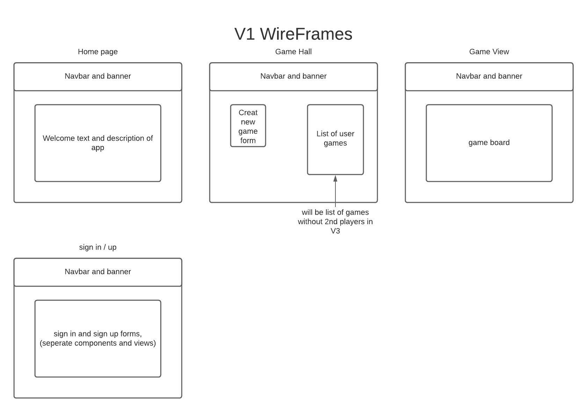
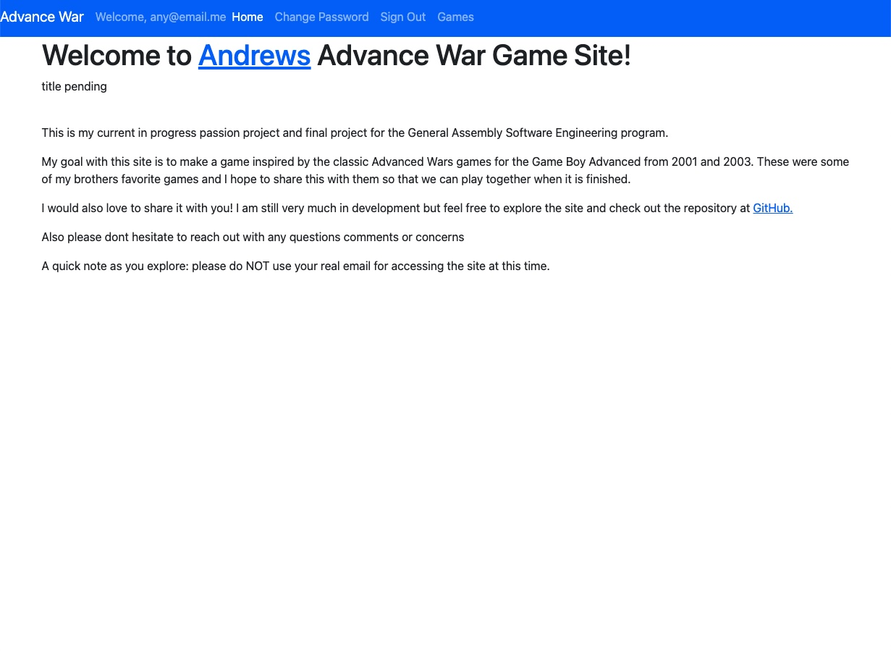
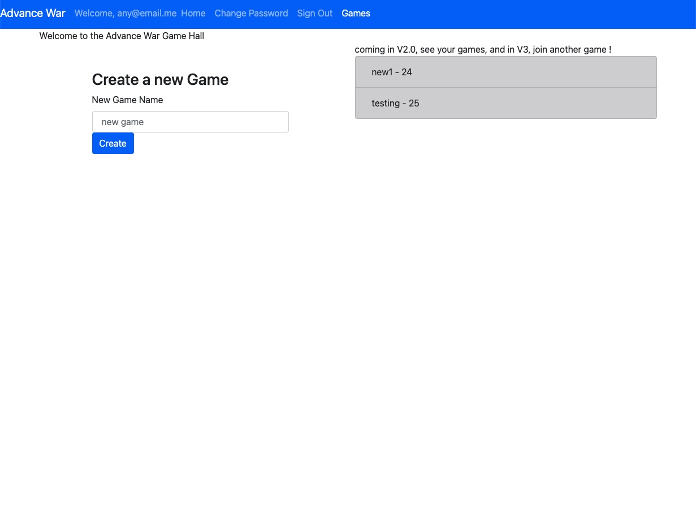
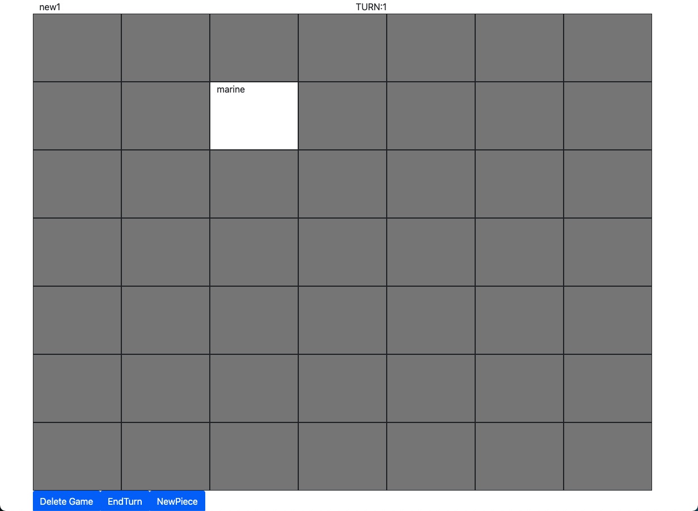

## Welcome to Andrews Advance War Game App!  
*game title pending*

This is my current in-progress passion project and final project for the General Assembly Software Engineering program. 
My goal with this application is to make a game inspired by the classic Advanced Wars games for the Game Boy Advanced from 2001 and 2003. These were some of my brothers favorite games and I hope to share this with them so that we can play together online when it is finished. 

At this time it is very unplayable.
However, a user can sign-up, sign-in, change-password, sign-out, navigate to the Game Hall by clicking games, view there current games, open a game or create a new one. on creating or opening a game the user is brought to the game view with the game title, turn number, board, and some buttons. the buttons are delete game: which deletes the game, pass turn: which patches the game resource in the api and updates the state to advance the turn by 1, and create piece: which currently creates a marine piece at the hardcoded location at 'gameInstance.js' line 142. When a piece is created the board is updated and displays the piece automatically.

To do this I am using ReactJs for the client application. I felt like this was a natural choice because the ability to leverage state and dynamically use it for generating the html on the page makes moving pieces around the board and doing logic checks an easier task than writing the data management from scratch or writing it all into the backend. Currently the game board is dynamically generated by a variable 'size' hard coded into the gameBoard.js file on line 43 which will be lifted to state later in development;(likely alongside the api model rewrite to support core game mechanics). There is also a 'GameCell' component that currently provides the html for the game board cells and displays any occupying piece's name in the cell. 

I am currently working on adding selection and movement functionality to the game piece, and plan to add a temporary form for generating new pieces before moving onto V2 of implementing game logic. 

Some major difficulties I've faced in the development of this part of the application are designing the component structure of the application and managing the state as I have more nested components. To manage this there are lots of console logs to print passed data at different points in the app control flow. 

My final goal/ V3 is to implement socket.io to support 2 player matches, after game mechanics and basic assets are implemented so I can share it with my family and friends.

I would also love to share it with you! I am still very much in development but feel free to explore the repository, fork, clone, comment etc.
Also please don't hesitate to reach out with any questions or comments.
If you would like to know when it is at a more developed stage add me on linkedin! https://www.linkedin.com/in/andrew-kestler/

A quick Final note as you explore: please do ***NOT*** use your real email for accessing the site at this time.

---

#### Links:
  * Deployed Site: https://kestler01.github.io/react_advanced_war_client/

  * Client Repo: https://github.com/kestler01/react_advanced_war_client/settings/pages

  * API Repo: https://github.com/kestler01/django_advanced_war_api

---

#### Technology Currently In Use:
  * ReactJs
  * JavaScript
  * ReactBootstrap
  * Axios
  * Html5
  * Css3
  * Git & Github

---

#### WireFrames: 

---

#### V1 ScreenShots:
HomePage

GameHall

GameBoard

 > due to the size of the screen, the navbar was cut off at the time, it is still at the top of the page in the game board view. 

---

#### User Stories:
A user wants to...
  * sign up
  * sign in
  * sign out
  * change their password
  * to view their games
  * create a game
  * view the game board
  * delete the game
  * create a game piece 
  * select a piece (WIP)
  * move pieces on the game board (WIP)

---

#### Installation instructions:
Want to use this repository as a template for your own application? 
start by forking and cloning this repository to your own github and remote environment. 
Run 'npm install', checkout a new branch. 
I suggest using this alongside the api I developed which is linked above. 
Do not forget to change the project name and to ensure that the apiConfig file is adjusted to your local settings. 
To publish your own app, run: 'npm run build'